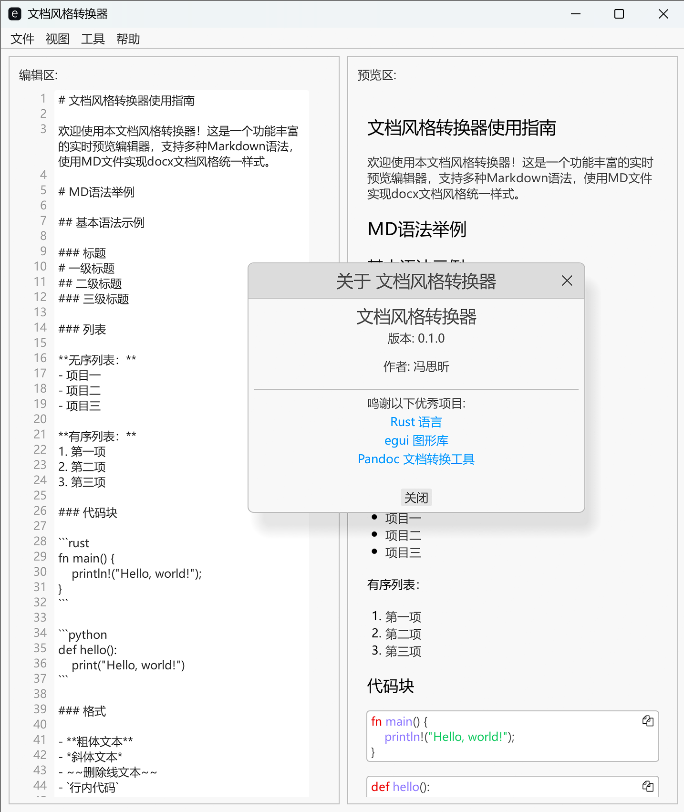

# RustF - 文档风格转换器
<p align="center">  </p>

**还在为手动调整 Word 文档样式而烦恼吗？**

**RustF** 是一个基于 ***egui** 和 **pandoc** 构建的 Markdown 编辑器，它专注于解决一个核心痛点：**将内容创作与文档样式彻底分离**，实现自动化、高效率的 **.docx** 文档生成。

## ✨ 核心理念与功能特性

本项目的诞生旨在解决传统文档协作中的样式统一难题。

  - ✍️ **内容与样式分离**：专注于使用 Markdown 进行高效的内容创作，将格式美化工作完全交给 **.docx** 样式模板。
  - 🎨 **高度自定义**：通过 Pandoc 的参考文档 (**reference-doc**) 功能，您可以创建并使用自定义的 **.docx** 模板，轻松实现“千人千面”的输出风格。
  - 🤝 **多人协作优化**：支持将多个 Markdown 文件按顺序合并，团队成员可以分工编辑各自的章节，互不干扰。
  - 🚀 **快捷键支持**：内置常用格式快捷键 (**Ctrl+B/I/U**) 和独特的模板变量快捷键 (**Ctrl+H**)，加速文档编写。
  - 🦀 **Rust 强力驱动**：基于 Rust 编译，程序体积小、运行速度快、内存安全。
  - 💻 **跨平台支持**：理论上支持 Windows, macOS 和 Linux (macOS 与 Linux 支持待完善)。

## 🚀 快速上手

在开始之前，请确保您了解基础的 [Markdown 语法](https://www.markdownguide.org/basic-syntax/)。

1.  **准备内容**：在一个文件夹中，按顺序命名您的 Markdown 文件 (例如 **01-前言.md**, **02-正文.md** ...)。
2.  **合并文件**：运行程序，通过 **文件** -\> **合并文件** 将所有 **.md** 文件载入编辑区。
3.  **(可选) 赋值模板变量**：如果您的内容中使用了 **{{变量名}}**格式的占位符，点击 **工具** -\> **模板赋值**，在弹出窗口中为所有变量赋值并应用。
4.  **设置样式模板**：通过 **文件** -\> **设置导出模板...**，选择一个您预先设计好的 **.docx** 文件作为样式参考。
5.  **导出文档**：点击 **文件** -\> **导出为 DOCX**，选择保存的位置和文件名，点击生成。
6.  **完成**！一个样式干净、格式统一的 **.docx** 文档就诞生了。从此，刷格式不再需要投入专门的人力！

## 🛠️ 技术选型与解读

#### 为什么选择 Markdown？

> 纯文本格式，让您无需关心样式，只需专注于内容。这是解决“内容-样式分离”问题的最佳途径。同时，当前主流的 AI 生成内容也默认使用 Markdown，便于无缝集成。

#### 市面上 MD 编辑器众多，为什么还需要 RustF？

> 确实，本项目无意成为一个全功能的 Markdown 编辑器。它的核心使命是**辅助您快速生成能被 Pandoc 识别并精确应用样式的、符合预期的 Markdown 源文档**。
>
>   * **快捷键** (**Ctrl+B/I/U**) 经过特殊设计，生成的标记能更好地被 Pandoc 识别并映射到 **.docx** 样式。
>   * **模板变量功能** (**Ctrl+H** 及赋值窗口) 是为了解决需要生成多份内容相似但细节不同的文档（例如多家公司的投标书）的痛点。

#### Pandoc 在项目中扮演什么角色？

> Pandoc 是一个强大的、跨平台的文档格式转换工具。它支持在 **docx**, **html**, **pdf**, **epub**, **markdown** 等数十种格式之间进行转换。
>
> 本程序目前主要利用 Pandoc 实现 **Markdown -> DOCX** 的转换。

## 🗺️ 未来路线图

  - [ ] **DOCX 到 MD 的转换**：增加 **.docx** -\> **.md** 的导入功能，简化将现有 Word 文档（如招标文件）转换为模板化内容的工作。
  - [ ] **图片拖拽导入**：实现将图片直接拖入编辑区，自动保存并生成 Markdown 链接的功能。
  - [ ] **表格编辑优化**：探索更便捷的表格创建与编辑方案，并改善从 Word 到 Markdown 的表格格式兼容性。
  - [ ] **Web 版本**：探索将程序编译为 WebAssembly，实现在浏览器中运行。

## 🔧 自行编译与运行

想亲自编译和运行本项目吗？请遵循以下步骤。

#### 1\. 前提条件

  - 安装 [Rust 工具链](https://www.rust-lang.org/tools/install)。
  - 安装 [Pandoc](https://pandoc.org/installing.html)，并确保它在您系统的环境变量**PATH**中。

#### 2\. 编译与运行

```bash
# 1. 克隆本项目仓库
git clone [您的项目 Git 仓库地址]
cd [项目目录]

# 2. 以开发模式运行
cargo run

# 3. 构建发布版本的可执行文件
# (文件将位于 target/release/ 目录下)
cargo build --release
```

## 💖 如何贡献

我们欢迎任何形式的贡献，无论是代码、文档还是好的建议！

1.  **报告问题**：如果您发现了 Bug 或者有功能建议，请在 [Issues](https://www.google.com/search?q=%5B%E6%82%A8%E7%9A%84%E9%A1%B9%E7%9B%AEIssues%E9%A1%B5%E9%9D%A2%E9%93%BE%E6%8E%A5%5D) 页面提交。
2.  **贡献代码**：
      * Fork 本仓库。
      * 创建一个新的分支 (**git checkout -b feature/YourAmazingFeature**)。
      * 提交您的修改 (**git commit -m 'Add some AmazingFeature'**)。
      * 将分支推送到您的 Fork (**git push origin feature/YourAmazingFeature**)。
      * 提交一个 **Pull Request**。

## 📜 许可证

本项目基于 [MIT License](https://www.google.com/search?q=%5B%E6%82%A8%E7%9A%84%E9%A1%B9%E7%9B%AELICENSE%E6%96%87%E4%BB%B6%E9%93%BE%E6%8E%A5%5D) 进行授权。

## 🙏 鸣谢

本项目的实现离不开以下优秀的开源项目：

  * [Rust 语言](https://www.rust-lang.org/)
  * [egui 框架](https://github.com/emilk/egui)
  * [Pandoc 工具](https://pandoc.org/)